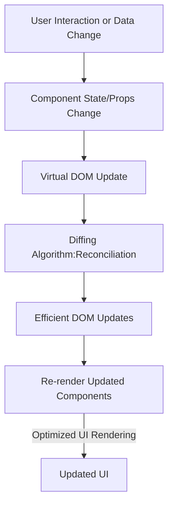

# How React Works

React operates by creating an in-memory **Virtual DOM** rather than directly manipulating the browser’s **Real DOM**. This approach improves performance by reducing unnecessary DOM updates.

## React Workflow

1. **Component Rendering:**
   - React components return JSX, which is converted to a virtual DOM representation.
   
2. **Virtual DOM Update:**
   - When a component’s state or props change, React updates the virtual DOM instead of the real DOM immediately.

3. **Diffing Algorithm (Reconciliation):**
   - React compares the new virtual DOM with the previous version to determine what has changed.

4. **Efficient Updates (DOM Patching):**
   - React updates only the necessary parts of the real DOM based on the differences found in the virtual DOM.

5. **Re-rendering:**
   - The affected components are re-rendered efficiently.

## React Workflow Diagram

## Benefits of Virtual DOM
- Improves performance by minimizing direct DOM manipulations.
- Ensures smooth and efficient updates to the user interface.
- Enhances developer experience with predictable component rendering.

React’s efficient update mechanism makes it a powerful choice for building modern web applications.

