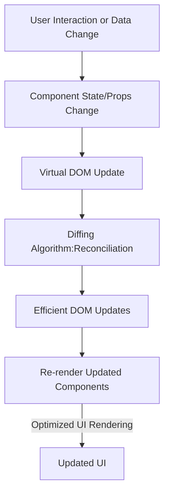

# React

React is a **JavaScript Library** *(Not a framework)* known for front-end development (or user interface). It is popular due to its **component-based architecture, Single Page Applications (SPAs) and Virtual DOM** for building web applications that are fast, efficient, and scalable.


# How React Works

React operates by creating an in-memory **Virtual DOM** rather than directly manipulating the browser’s **Real DOM**. This approach improves performance by reducing unnecessary DOM updates.


## React Workflow

1. **Component Rendering:**
   - React components return JSX, which is converted to a virtual DOM representation.
   
2. **Virtual DOM Update:**
   - When a component’s state or props change, React updates the virtual DOM instead of the real DOM immediately.

3. **Diffing Algorithm (Reconciliation):**
   - React compares the new virtual DOM with the previous version to determine what has changed.

4. **Efficient Updates (DOM Patching):**
   - React updates only the necessary parts of the real DOM based on the differences found in the virtual DOM.

5. **Re-rendering:**
   - The affected components are re-rendered efficiently.

## React Workflow Diagram



## Benefits of Virtual DOM
- Improves performance by minimizing direct DOM manipulations.
- Ensures smooth and efficient updates to the user interface.
- Enhances developer experience with predictable component rendering.

React’s efficient update mechanism makes it a powerful choice for building modern web applications.


# React import/export
In React, importing and exporting components allows you to share and reuse code across different files. Components can be exported using either default or named exports, and then imported into other files to be used.

1. Default Export and Import
   - A file can have only one default export.
   - When importing, you can name it anything.


   ```jsx
   // Export (MyComponent.js)
   export default function MyComponent() {
       return <h1>Hello</h1>;
   }
   
   // Import (App.js)
   import Hello from './MyComponent'; // Can be named anything and used like <Hello/>

   ```
    
2. Named Export and Import
   - A file can have multiple named exports.
   - When importing, you must use curly braces and the exact name.
  
   ```jsx
   // Export (utils.js)
   export function add(a, b) { return a + b; }
   export function subtract(a, b) { return a - b; }
   
   // Import (App.js)
   import { add, subtract } from './utils';

   ```
     
3. Combining Default and Named Exports
   - You can export both default and named components from the same file.
  
   ```jsx
   // Export (MyModule.js)
   export default function MainComponent() { return <h1>Main</h1>; }
   export function HelperComponent() { return <h2>Helper</h2>; }
   
   // Import (App.js)
   import MainComponent, { HelperComponent } from './MyModule';

   ```

4. Exporting Multiple Components from the Same File
   - Instead of exporting components from separate files, you can group them.

   ```jsx
   // Export (Components.js)
   export function Header() { return <header>Header</header>; }
   export function Footer() { return <footer>Footer</footer>; }
   
   // Import (App.js)
   import { Header, Footer } from './Components';

   ```

### When to Use Default Export
- Use for a single primary functionality or component in a file.
- When you want flexibility in naming during import.
- Ideal for components or modules that represent the main purpose of the file.
  
### When to Use Named Export
- Use when exporting multiple functionalities or components from the same file.
- When you want consistency in import names.
- Useful for utility functions, constants, or multiple related components.
